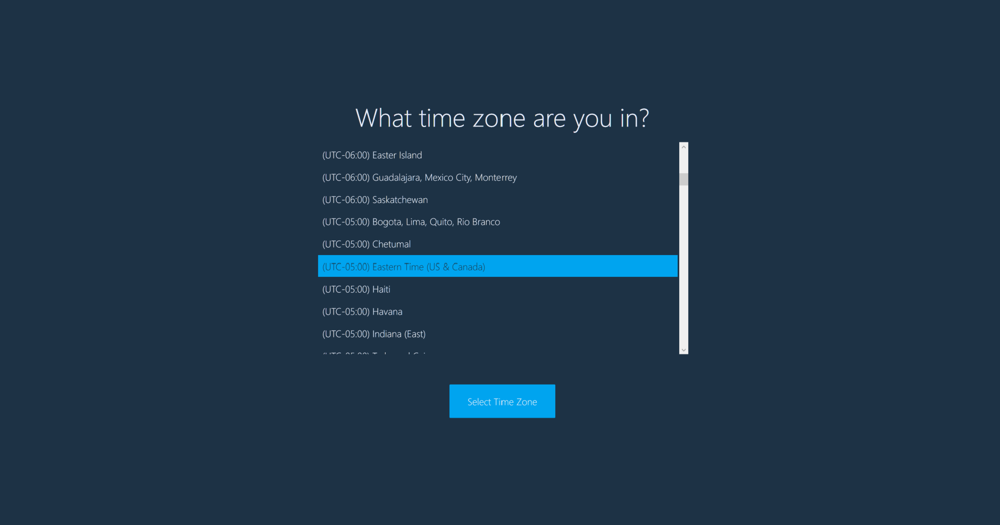
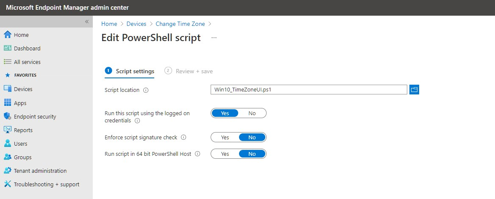

# Select a Time Zone

## Overview

I wrote this UI in PowerShell for users to change the time zone on their device. This was originally intended for a user to select their time zone on first logon right after AutoPilot ESP because there is not time zone selection for during Autopilot.

<https://www.powershellcrack.com/2019/12/select-time-zone-using-powershell-wpf.html>
## The Look

I wanted the this to window to look and feel like something from Windows Out-of-Box-Experience (OOBE).

Simple (TimeZoneUI.ps1)


Windows 10 OOBE version (Win10_TimeZoneUI.ps1)


Windows 11 (coming soon)


## How to Use

Parameter | Type| Explanation | Requirements
-- | -- | -- | --
IpStackAPIKey | string |  Used to get geoCoordinates of the public IP. get the API key from <https://ipstack.com>
BingMapsAPIKey | string |  Used to get the Windows TimeZone value of the location coordinates. get the API key from https://azuremarketplace.microsoft.com/en-us/marketplace/apps/bingmaps.mapapis
UserDriven | Boolean (true or False) | Deploy to user when set to true. sets either HKCU key or HKLM key. Set to true if the deployment is for autopilot | Permission required for HKLM
OnlyRunOnce | Boolean (true or False) |  Specify that this script will only launch the form one time.
ForceTimeSelection | Switch | Disabled and with Bing API --> Current timezone and geo timezone will be compared; if different, form will be displayed. Enabled --> the selection will always show
AutoTimeSelection | Switch | Enabled with Bing API --> No prompt for user, time will update on it own. Enabled without Bing API --> User will be prompted at least once. Ignored if ForceTimeSelection is enabled
UpdateTime | Switch | Used only with IPstack and Bing API. Set local time and date (NOT TIMEZONE) based on GEO location | Requires administrative permissions

Examples
```powershell
#Uses IP GEO location for the pre-selection
.\TimeZoneUI.ps1 -IpStackAPIKey = "4bd1443445dfhrrt9dvefr45341" -BingMapsAPIKey = "Bh53uNUOwg71czosmd73hKfdHf465ddfhrtpiohvknlkewufjf4-d" -Verbose

#This will always display the time selection screen;
.\TimeZoneUI.ps1 -ForceTimeSelection

#This will set the time automatically using the IP GEO location without prompting user.
.\TimeZoneUI.ps1 -IpStackAPIKey = "4bd1443445dfhrrt9dvefr45341" -BingMapsAPIKey = "Bh53uNUOwg71czosmd73hKfdHf465ddfhrtpiohvknlkewufjf4-d" -AutoTimeSelection -UpdateTime

# Writes a registry key in HKLM hive to determine run status
.\TimeZoneUI.ps1 -UserDriven:$false

#Mainly for Autopilot powershell scripts; this allows the screen to display one time after ESP is completed.
.\TimeZoneUI.ps1 -OnlyRunOnce:$true

#>
```

## Ready to deploy?

### For Autopilot

- This is only tested on a single user device. have not tested it on multiuser or Kiosk device.
- This runs in User context but for the device

_NOTE:_ This script does have parameters. When importing scripts into Intune, you don't have the option for parameters. 

**If you want more granular controls** during deployment, copy theses parameters as variables to line 95, just after the original parameter calls. Set the values as needed (read the _How to use_ section to understand each variable)

```powershell
[string]$IpStackAPIKey = ""
[string]$BingMapsAPIKey = ""
[boolean]$UserDriven = $true
[boolean]$OnlyRunOnce = $true
[boolean]$ForceTimeSelection = $false
[boolean]$AutoTimeSelection = $false
[boolean]$UpdateTime = $false
```

**Import steps:**
1. Login into <https://endpoint.microsoft.com>
1. Navigate to Devices-->Scripts
1. Click _Add_ --> Windows 10 and Later
1. give it a name (eg. Win10 TimeZone Selector)
1. Import the PowerShell script
1. Select **Yes** for Run this script using the logged on credentials
1. Select **No** for Enforce script signature check
1. Select **No** for Run script in 64 bit PowerShell Host

Intune Screenshot



1. Build an Azure Dynamic Device Group using query:

```kusto
    (device.devicePhysicalIDs -any _ -contains "[ZTDID]")
```


1. Assign script to Azure Dynamic Device Group


# DISCLAIMER

THE SOFTWARE IS PROVIDED "AS IS", WITHOUT WARRANTY OF ANY KIND, EXPRESS
OR IMPLIED, INCLUDING BUT NOT LIMITED TO THE WARRANTIES OF MERCHANTABILITY,
FITNESS FOR A PARTICULAR PURPOSE AND NONINFRINGEMENT. IN NO EVENT SHALL THE
AUTHORS OR COPYRIGHT HOLDERS BE LIABLE FOR ANY CLAIM, DAMAGES OR OTHER
LIABILITY, WHETHER IN AN ACTION OF CONTRACT, TORT OR OTHERWISE, ARISING
FROM, OUT OF OR IN CONNECTION WITH THE SOFTWARE OR THE USE OR OTHER
DEALINGS IN THE SOFTWARE.
