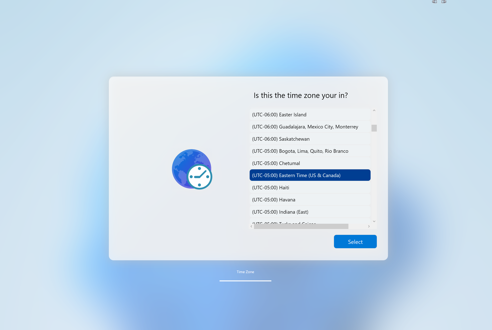

# Select a Time Zone

- [Overview](#overview)
- [The Look](#the-look)
- [How to Use](#how-to-use)
- [Ready to deploy?](#ready-to-deploy)
  - [Device Footprint](#device-footprint)
  - [For TaskSequence](#for-tasksequence)
  - [For Autopilot](#for-autopilot)
- [Log File](#logfile)
<hr>

## <a name="overview"></a>Overview

> I wrote this UI in PowerShell for users to change the time zone on their device. This was originally intended for a user to select their time zone on first logon right after AutoPilot ESP because there is not time zone selection for during Autopilot.

<https://www.powershellcrack.com/2019/12/select-time-zone-using-powershell-wpf.html>
## <a name="the-look"></a>The look

> I wanted this to interface window to look and feel something from Windows Out-of-Box-Experience (OOBE), so I developed three versions of it...

Simple (TimeZoneUI.ps1)


Windows 10 OOBE version (TimeZoneUI_Win10.ps1)


Windows 11 OOBE version (TimeZoneUI_Win11.ps1)


## <a name="how-to-use"></a>How to Use
For all parameters that are true/false I decided to make them boolean (instead of switches) so they can be hardcoded at the parameter level without calling them. this is ideal when deploying the script from Intune because you cannot call parameters.

Parameter | Type| Default value | Explanation | Requirements
-- | -- | -- | -- | --
SyncNTP | String | _pool.ntp.org_ | This value can be changed. If value exist, the script will attempt to sync time with NTP. If this is not desired, remove the value. | NTP port UDP 123
IpStackAPIKey | String | Null | Used to get geoCoordinates of the public IP. get the API key from <https://ipstack.com>
BingMapsAPIKey | String |  Null | Used to get the Windows TimeZone value of the location coordinates. get the API key from https://azuremarketplace.microsoft.com/en-us/marketplace/apps/bingmaps.mapapis
NoControl | Boolean | _False_ | This is **ONLY** used to not track or write registry keys to the device. UserDriven & RunOnce options are **IGNORED**.|
UserDriven | Boolean | _True_ | Deploy to user when set to true. if _true_ sets HKCU key, if _false_, set HKLM key. | Set to true if the deployment is for autopilot. _Users context_ deployment will need permission to write to HKLM
OnlyRunOnce | Boolean |  _True_ | Specifies this script will only launch one time. If its user-driven it will launch once per user on one device. If its device driven, it will only launch once for a user on the device.
NoUI | Boolean | _False_ | If set to _true_, the UI will not show but still attempt to set the timezone. If API Keys are provided it will use the internet to determine location. If Keys are not set, then it won't change the timezone because its the same as before, but it will attempt to sync time if a NTP value is provided.
ForceInteraction |  Boolean | _False_ | If set to _True_, no matter the other settings (including _NoUI_), the UI will **ALWAYS** show!

Examples
```powershell

# EXAMPLE 1
.\TimeZoneUI.ps1 -IpStackAPIKey "4bd1443445dfhrrt9dvefr45341" -BingMapsAPIKey "Bh53uNUOwg71czosmd73hKfdHf465ddfhrtpiohvknlkewufjf4-d" -Verbose
# RESULT: Uses IP GEO location for the pre-selection

# EXAMPLE 2
.\TimeZoneUI.ps1 -ForceInteraction:$true -verbose
# RESULT:  This will ALWAYS display the time selection screen; if IPStack and BingMapsAPI included the IP GEO location timezone will be preselected. Verbose output will be displayed

# EXAMPLE 3
.\TimeZoneUI.ps1 -IpStackAPIKey "4bd1443445dfhrrt9dvefr45341" -BingMapsAPIKey "Bh53uNUOwg71czosmd73hKfdHf465ddfhrtpiohvknlkewufjf4-d" -NoUI:$true -SyncNTP "time-a-g.nist.gov"
# RESULT: This will set the time automatically using the IP GEO location without prompting user. If API not provided, timezone or time will not change the current settings

# EXAMPLE 4
.\TimeZoneUI.ps1 -UserDriven:$false
 # RESULT: Writes a registry key in System (HKEY_LOCAL_MACHINE) hive to determine run status

# EXAMPLE 5
.\TimeZoneUI.ps1 -RunOnce:$true
# RESULT: This allows the screen to display one time. RECOMMENDED for Autopilot to display after ESP screen

```

## <a name="ready-to-deploy"></a>Ready to deploy?
This is a script that can easily be deployed in many different ways. It can be done via tasksequence, software delivery, MECM scripts, Intune Powershell, etc.

### <a name="device-footprint"></a>Device Footprint
Keep in mind that by running this script, be default it will write a registry key to the user hive stating its last run status. This is to ensure the script is not ran a second time unless ForceRuntTime is specified

The key paths are located here:

```cmd
HKEY_CURRENT_USER\Software\PowerShellCrack\TimeZoneSelector <-- User Driven
HKEY_LOCAL_MACHINE\Software\PowerShellCrack\TimeZoneSelector <-- System Driven
```

The keys that are written are:

Keys | Type | Explanation | Notes
--|--|--|--
LastRun | REG_SZ |This is in date time format and is updated through each stage of the script.
Status | REG_SZ |The last known status of the script. It can be either: Failed, Running, Completed. | If UI crashes at any point it will be at _Running_ State
SyncdToNTP | REG_SZ |The NTP server the script used. Default is _pool.ntp.org_. | Set the param SyncNTP to a valid NTP URL value
TimeZoneSelected | REG_SZ |The selection made in the UI. | If no UI is shown the key will not be set.

The _NoControl_ switch disables that feature, however this could result in __undesired affects__ where the user is prompted multiple times depending on deployment schedule.

### <a name=">additional-variables"></a>Additional Variables
There is only one additional variable that can not be set by a parameter, that's on line __260__. Edit this to a specific NTP server if you like. Also keep in mind this will only be used if the SyncTime parameter is set to true.

```powershell
$Global:NTPServer = 'pool.ntp.org'
```


### <a name="for-tasksequence"></a>For TaskSequence
The script will detect if its running in a Taskseqeunce and automatically set the appropriate value for the TaskSequence variables:

Variable | Value
-- | --
OSDMigrateTimeZone | $true
OSDTimeZone | (eg. Eastern Standard Time)

You can let the OSD migration change the Timezone or use a command to change the TimeZone using the variable like so:

```cmd
cmd /c tzutil /S "%OSDTimeZone%"
```

I am working on a solution to set the MDT index value (eg. 034) as well
### <a name="for-autopilot"></a>For Autopilot

- This is only tested on a single user device. have not tested it on multi-user or Kiosk device.
- This runs in User context but for the device

_NOTE:_ This script does have parameters. When importing scripts into Intune, you don't have the option for parameters.

**If you want more granular controls** during deployment, copy theses parameters as variables to line 95, just after the original parameter calls. Set the values as needed (read the _How to use_ section to understand each variable)

```powershell
[string]$IpStackAPIKey = ""
[string]$BingMapsAPIKey = ""
[boolean]$UserDriven = $true
[boolean]$OnlyRunOnce = $true
[boolean]$ForceTimeSelection = $false
[boolean]$AutoTimeSelection = $false
[boolean]$UpdateTime = $false
```

**Import steps:**
1. Login into <https://endpoint.microsoft.com>
1. Navigate to Devices-->Scripts
1. Click _Add_ --> Windows 10 and Later
1. give it a name (eg. Win10 TimeZone Selector)
1. Import the PowerShell script
1. Select **Yes** for Run this script using the logged on credentials
1. Select **No** for Enforce script signature check
1. Select **No** for Run script in 64 bit PowerShell Host

Intune Screenshot


1. Build an Azure Dynamic Device Group using query:

```kusto
    (device.devicePhysicalIDs -any _ -contains "[ZTDID]")
```


1. Assign script to Azure Dynamic Device Group

## <a name="logfile"></a>Log File

The script does output a log file; the location is depending on what environment the script is running in:

- During Tasksequence (In WINPE before Format disk) --> **X:\Windows\temp\smstslog\TimeZoneUI.log**
- During Tasksequence (In WINPE after format disk) --> **C:\\_SMSTaskSequence\Logs\smstslog\TimeZoneUI.log**
- During Tasksequence (Windows OS & no CCM client) --> **C:\\_SMSTaskSequence\Logs\smstslog\TimeZoneUI.log**
- During Tasksequence (Windows OS with CCM client) --> **C:\\Windows\CCM\Logs\smstslog\TimeZoneUI.log**
- No Task sequence (eg. AutoPilot) UserDriven --> **C:\Users\\<Username\>\Appdata\Local\Temp\TimeZoneUI.log**
- No Task sequence (eg. AutoPilot) System Driven --> **C:\Windows\Temp\TimeZoneUI.log**

# DISCLAIMER

THE SOFTWARE IS PROVIDED "AS IS", WITHOUT WARRANTY OF ANY KIND, EXPRESS
OR IMPLIED, INCLUDING BUT NOT LIMITED TO THE WARRANTIES OF MERCHANTABILITY,
FITNESS FOR A PARTICULAR PURPOSE AND NONINFRINGEMENT. IN NO EVENT SHALL THE
AUTHORS OR COPYRIGHT HOLDERS BE LIABLE FOR ANY CLAIM, DAMAGES OR OTHER
LIABILITY, WHETHER IN AN ACTION OF CONTRACT, TORT OR OTHERWISE, ARISING
FROM, OUT OF OR IN CONNECTION WITH THE SOFTWARE OR THE USE OR OTHER
DEALINGS IN THE SOFTWARE.
